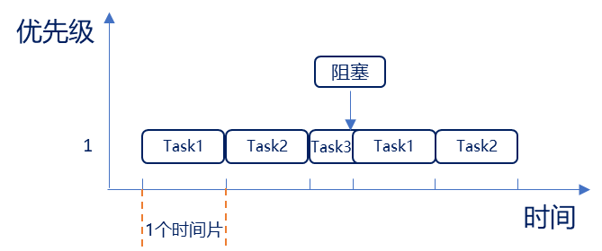

# FreeRTOS基础知识

## 任务调度简介

调度器就是使用相关的调度算法来决定当前需要执行的哪个任务

FreeRTOS 一共支持三种任务调度方式： 

抢占式调度

​	主要是针对优先级不同的任务，每个任务都有一个优先级，优先级高的任务可以抢占优先级低的任务。

时间片调度

​	主要针对优先级相同的任务，当多个任务的优先级相同时， 任务调度器会在每一次系统时钟节拍到的时候切换任务。

协程式调度

​	当前执行任务将会一直运行，同时高优先级的任务不会抢占低优先级任务

FreeRTOS现在虽然还支持，但是官方已经表示不再更新协程式调度

### 抢占式调度


运行过程如下：

1、首先Task1在运行中，在这个过程中Task2就绪了，在抢占式调度器的作用下Task2会抢占Task1的运行

2、Task2运行过程中，Task3就绪了，在抢占式调度器的作用下Task3会抢占Task2的运行

3、Task3运行过程中，Task3阻塞了（系统延时或等待信号量等），此时就绪态中，优先级最高的任务Task2执行

4、Task3阻塞解除了（延时到了或者接收到信号量），此时Task3恢复到就绪态中，抢占TasK2的运行

总结：

1、高优先级任务，优先执行

2、高优先级任务不停止，低优先级任务无法执行

3、被抢占的任务将会进入就绪态

### 时间片调度

同等优先级任务轮流地享有相同的 CPU 时间(可设置)， 叫时间片，在FreeRTOS中，一个时间片就等于SysTick 中断周期，注意没有用完的时间片不会再使用



运行过程如下：

1、首先Task1运行完一个时间片后，切换至Task2运行

2、Task2运行完一个时间片后，切换至Task3运行

3、Task3运行过程中（还不到一个时间片），Task3阻塞了（系统延时或等待信号量等），此时直接切换到下一个任务Task1

4、Task1运行完一个时间片后，切换至Task2运行

## 任务状态

FreeRTOS中任务共存在4种状态：

1、运行态	正在执行的任务，该任务就处于运行态，注意在STM32中，同一时间仅一个任务处于运行态

2、就绪态	如果该任务已经能够被执行，但当前还未被执行，那么该任务处于就绪态

3、阻塞态	如果一个任务因延时或等待外部事件发生，那么这个任务就处于阻塞态

4、挂起态	类似暂停，调用函数 vTaskSuspend() 进入挂起态，需要调用解挂函数vTaskResume()

才可以进入就绪态

四种任务状态之间的转换图：


总结：

1、仅就绪态可转变成运行态

2、其他状态的任务想运行，必须先转变成就绪态

这四种状态中，除了运行态，其他三种任务状态的任务都有其对应的任务状态列表

1、就绪列表	pxReadyTasksLists[x]，其中x代表任务优先级数值，x取值0~31，当某个位，置一时，代表所对应的优先级就绪列表有任务存在

2、阻塞列表	pxDelayedTaskList

3、挂起列表	xSuspendedTaskList

# FreeRTOS的任务创建和删除

任务的创建和删除本质就是调用FreeRTOS的API函数

| API函数             | 描述             |
| ------------------- | ---------------- |
| xTaskCreate()       | 动态方式创建任务 |
| xTaskCreateStatic() | 静态方式创建任务 |
| vTaskDelete()       | 删除任务         |

动态创建任务	任务的任务控制块以及任务的栈空间所需的内存，均由 FreeRTOS 从 FreeRTOS 管理的堆中分配 

静态创建任务	任务的任务控制块以及任务的栈空间所需的内存，需用户分配提供

## 动态创建任务函数

```c
BaseType_t xTaskCreate
( 	TaskFunction_t 					pxTaskCode,		/* 指向任务函数的指针 */					
 	const char * const 				pcName, 		/* 任务名字，最大长度configMAX_TASK_NAME_LEN */
	const 	configSTACK_DEPTH_TYPE  usStackDepth, 	/* 任务堆栈大小，注意字为单位 */
	void * const 					pvParameters,	/* 传递给任务函数的参数 */
	UBaseType_t 					uxPriority,		/* 任务优先级，范围：0 ~ configMAX_PRIORITIES - 1 */
	TaskHandle_t * const 			pxCreatedTask 	/* 任务句柄，就是任务的任务控制块 */
)
```

| **返回值**                            | **描述**     |
| ------------------------------------- | ------------ |
| pdPASS                                | 任务创建成功 |
| errCOULD_NOT_ALLOCATE_REQUIRED_MEMORY | 任务创建失败 |

### 实现动态创建任务流程 (用起来只需这三步)

1、将宏configSUPPORT_DYNAMIC_ALLOCATION 配置为 1 

2、定义函数入口参数

3、编写任务函数

### 动态创建任务函数内部实现 (此函数创建的任务会立刻进入就绪态，由任务调度器调度运行)

1、申请堆栈内存&任务控制块内存

2、TCB结构体成员赋值

3、添加新任务到就绪列表中

### 任务控制块结构体成员介绍

```c
typedef struct tskTaskControlBlock       
{
    	volatile StackType_t 	* pxTopOfStack; 						/* 任务栈栈顶，必须为TCB的第一个成员 */
   		ListItem_t 				xStateListItem;           				/* 任务状态列表项 */      
		ListItem_t 				xEventListItem;							/* 任务事件列表项 */     
    	UBaseType_t 			uxPriority;                				/* 任务优先级，数值越大，优先级越大 */
    	StackType_t 			* pxStack;								/* 任务栈起始地址 */
    	char 					pcTaskName[ configMAX_TASK_NAME_LEN ]; 	/* 任务名字 */		
	…
	省略很多条件编译的成员
} tskTCB;
```

任务栈栈顶，在任务切换时的任务上下文保存、任务恢复息息相关

注意：每个任务都有属于自己的任务控制块，类似身份证

## 静态创建任务函数

```c
TaskHandle_t xTaskCreateStatic
(
    	TaskFunction_t			pxTaskCode,				/* 指向任务函数的指针 */
    	const char * const		pcName,					/* 任务函数名 */
    	const uint32_t			ulStackDepth, 			/* 任务堆栈大小注意字为单位 */
    	void * const			pvParameters, 			/* 传递的任务函数参数 */
    	UBaseType_t				uxPriority, 			/* 任务优先级 */
    	StackType_t * const		puxStackBuffer, 		/* 任务堆栈，一般为数组，由用户分配 */
    	StaticTask_t * const	pxTaskBuffer			/* 任务控制块指针，由用户分配 */
); 		
```

| **返回值** | **描述**                             |
| ---------- | ------------------------------------ |
| NULL       | 用户没有提供相应的内存，任务创建失败 |
| 其他值     | 任务句柄，任务创建成功               |

### 静态创建任务使用流程 (用起来只需这五步)

1、需将宏configSUPPORT_STATIC_ALLOCATION 配置为 1 

2、定义空闲任务&定时器任务的任务堆栈及TCB

3、实现两个接口函数 vApplicationGetIdleTaskMemory( )  和 vApplicationGetTimerTaskMemory ( )

4、定义函数入口参数

5、编写任务函数

此函数创建的任务会立刻进入就绪态，由任务调度器调度运行

### 静态创建内部实现

1、TCB结构体成员赋值

2、添加新任务到就绪列表中

## 任务删除函数

```c
void vTaskDelete(TaskHandle_t xTaskToDelete);
```

| **形参**      | **描述**             |
| ------------- | -------------------- |
| xTaskToDelete | 待删除任务的任务句柄 |

用于删除已被创建的任务

被删除的任务将从就绪态任务列表、阻塞态任务列表、挂起态任务列表和事件列表中移除

注意: 

1、当传入的参数为NULL，则代表删除任务自身（当前正在运行的任务）

2、空闲任务会负责释放被删除任务中由系统分配的内存，但是由用户在任务删除前申请的内存， 则需要由用户在任务被删除前提前释放，否则将导致内存泄露 

### 删除任务流程 (用起来只要这两步)

1、使用删除任务函数，需将宏INCLUDE_vTaskDelete 配置为 1 

2、入口参数输入需要删除的任务句柄（NULL代表删除本身）

### 删除任务函数的内部实现过程

1、获取所要删除任务的控制块	通过传入的任务句柄，判断所需要删除哪个任务，NULL代表删除自身

2、将被删除任务，移除所在列表	将该任务在所在列表中移除，包括：就绪、阻塞、挂起、事件等列表

3、判断所需要删除的任务	如果删除任务自身，需先添加到等待删除列表，内存释放将在空闲任务执行,如果删除其他任务，释放内存，任务数量--

4、更新下个任务的阻塞时间	更新下一个任务的阻塞超时时间，以防被删除的任务就是下一个阻塞超时的任务

# FreeRTOS的任务挂起与恢复

## 任务的挂起与恢复的API函数

| API函数              | 描述                     |
| -------------------- | ------------------------ |
| vTaskSuspend()       | 挂起任务                 |
| vTaskResume()        | 恢复被挂起的任务         |
| xTaskResumeFromISR() | 在中断中恢复被挂起的任务 |

挂起	挂起任务类似暂停，可恢复； 删除任务，无法恢复，类似“人死两清”

恢复	恢复被挂起的任务

“FromISR”	带FromISR后缀是在中断函数中专用的API函数

## 任务挂起函数介绍

```c
void vTaskSuspend(TaskHandle_t xTaskToSuspend) 
```

| **形参**       | **描述**             |
| -------------- | -------------------- |
| xTaskToSuspend | 待挂起任务的任务句柄 |

此函数用于挂起任务，使用时需将宏 INCLUDE_vTaskSuspend 配置为 1。 

无论优先级如何，被挂起的任务都将不再被执行，直到任务被恢复 。

注意：当传入的参数为NULL，则代表挂起任务自身（当前正在运行的任务）

## 任务恢复函数介绍（任务中恢复）

```c
任务中恢复被挂起函数：void vTaskResume(TaskHandle_t xTaskToResume) 
```

| **形参**      | **描述**             |
| ------------- | -------------------- |
| xTaskToResume | 待恢复任务的任务句柄 |

使用该函数注意宏：INCLUDE_vTaskSuspend必须定义为 1

注意：任务无论被 vTaskSuspend() 挂起多少次，只需在任务中调用 vTakResume() 恢复一次，就可以继续运行。且被恢复的任务会进入就绪态！ 

## 任务恢复函数介绍（中断中恢复）

```c
中断中恢复被挂起函数： BaseType_t xTaskResumeFromISR(TaskHandle_t xTaskToResume)  
```

| **形参**      | **描述**             |
| ------------- | -------------------- |
| xTaskToResume | 待恢复任务的任务句柄 |

函数：xTaskResumeFromISR返回值描述如下：

| **返回值** | **描述**                     |
| ---------- | ---------------------------- |
| pdTRUE     | 任务恢复后需要进行任务切换   |
| pdFALSE    | 任务恢复后不需要进行任务切换 |

使用该函数注意宏：INCLUDE_vTaskSuspend 和 INCLUDE_xTaskResumeFromISR 必须定义为 1

该函数专用于中断服务函数中，用于解挂被挂起任务

注意：中断服务程序中要调用freeRTOS的API函数则中断优先级不能高于FreeRTOS所管理的最高优先级

## 任务挂起函数内部实现

1、获取所要挂起任务的控制块	通过传入的任务句柄，判断所需要挂起哪个任务，NULL代表挂起自身

2、移除所在列表	将要挂起的任务从相应的状态列表和事件列表中移除（就绪或阻塞列表）

3、插入挂起任务列表	将待挂起任务的任务状态列表向插入到挂起态任务列表末尾

4、判断任务调度器是否运行	在运行，更新下一次阻塞时间，防止被挂起任务为下一次阻塞超时任务

5、判断待挂起任务是否为当前任务	如果挂起的是任务自身，且调度器正在运行，需要进行一次任务切换, 调度器没有运行，判断挂起任务数是否等于任务总数，是：当前控制块赋值为NULL，否：寻找下一个最高优先级任务

